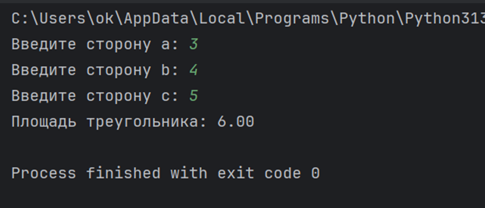
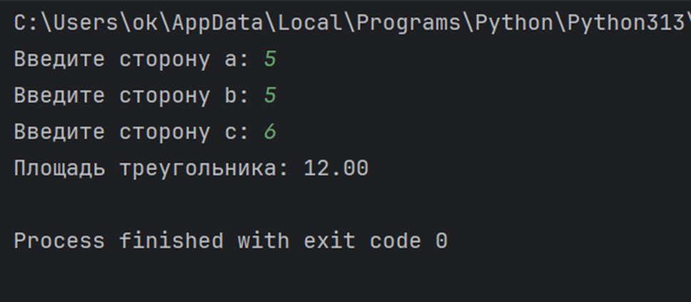
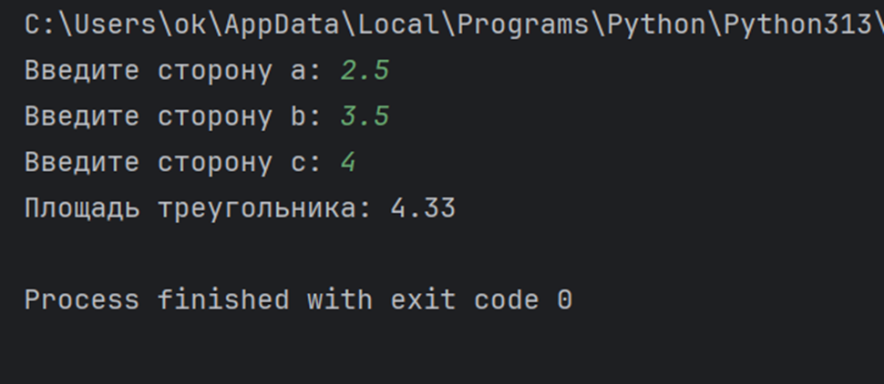
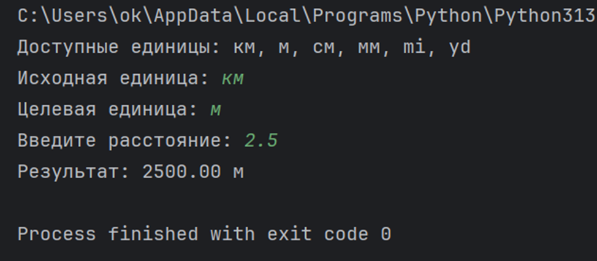
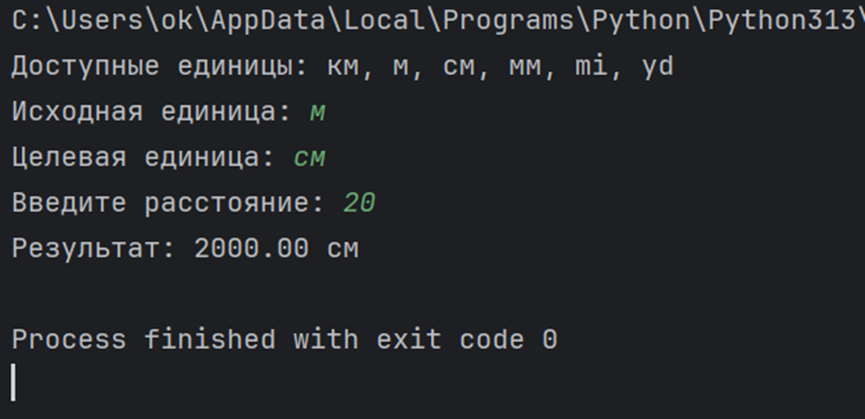
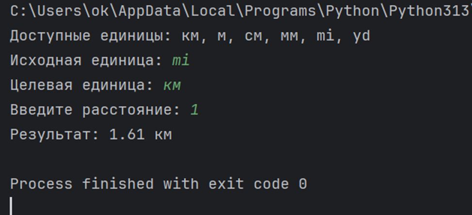
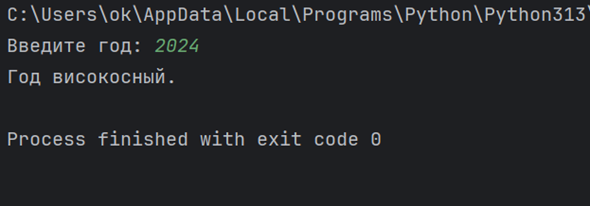
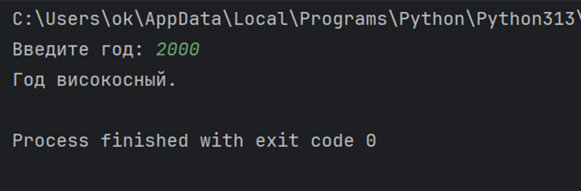
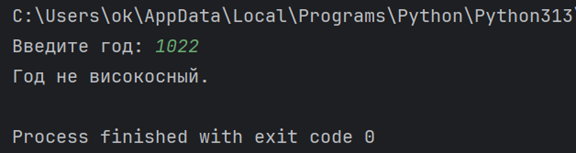

# Лабораторная работа №01

## Исполнитель

**ФИО:** Зуев Владислав Евгеньевич  
**Группа:** Фт-250008

---

## Проект 1 — Площадь треугольника

### Задание

Написать программу, которая по трём введённым сторонам треугольника проверяет возможность его существования и вычисляет его площадь по формуле Герона.

Программа:
- запрашивает значения сторон `a`, `b` и `c`;
- проверяет существование треугольника;
- если треугольник существует, вычисляет его площадь;
- выводит результат с точностью до двух знаков после запятой.

### Пример работы

```text
Введите сторону a: 3
Введите сторону b: 4
Введите сторону c: 5
Площадь треугольника: 6.00
```

Если треугольник с указанными сторонами не существует:

```text
Введите сторону a: 1
Введите сторону b: 2
Введите сторону c: 5
Треугольник с такими сторонами не существует.
```

### Скриншоты тестирования

**Тест 1:**



**Тест 2:**



**Тест 3:**



---

## Проект 2 — Конвертер единиц расстояния

### Задание

Разработать программу для перевода расстояния из одной единицы измерения в другую.

Поддерживаются следующие единицы измерения:

- `км` — километр;
- `м` — метр;
- `см` — сантиметр;
- `мм` — миллиметр;
- `mi` — миля;
- `yd` — ярд.

Программа:
1. выводит список доступных единиц;
2. запрашивает исходную единицу;
3. запрашивает целевую единицу;
4. запрашивает значение расстояния;
5. выполняет преобразование;
6. выводит результат.

### Пример работы

```text
Доступные единицы: км, м, см, мм, mi, yd
Исходная единица: км
Целевая единица: м
Введите расстояние: 2
Результат: 2000.00 м
```

При вводе неизвестной единицы:

```text
Ошибка: неизвестная единица измерения.
```

### Скриншоты тестирования

**Тест 1:**



**Тест 2:**



**Тест 3:**



---

## Проект 3 — Проверка високосного года

### Задание

Написать программу, которая по введённому году определяет, является ли он високосным.

Правила определения високосного года:
- год является високосным, если он делится на 400;
- либо если он делится на 4, но не делится на 100;
- в остальных случаях год не является високосным.

### Пример работы

```text
Введите год: 2024
Год високосный.
```

Пример для невисокосного года:

```text
Введите год: 2023
Год не високосный.
```

### Скриншоты тестирования

**Тест 1:**



**Тест 2:**



**Тест 3:**



---

# Среда разработки

Проекты написаны на языке программирования **Python**.

Для открытия и запуска проектов можно использовать:

- **PyCharm**;
- **Visual Studio Code**;
- **IDLE**;
- любую другую среду разработки, поддерживающую Python.

Для запуска необходим установленный **Python 3.x**.

Каждый проект представляет собой отдельную папку. Для запуска необходимо открыть соответствующий файл с расширением `.py`.

---

# Как запустить программу

## Запуск через PyCharm

1. Открыть PyCharm.
2. Выбрать **Open** и указать папку нужного проекта.
3. Открыть файл `.py`.
4. Нажать кнопку **Run** или использовать сочетание клавиш `Shift + F10`.
5. В консоли ввести необходимые данные.

## Запуск через командную строку

Перейти в папку нужного проекта и выполнить команду:

```bash
python имя_файла.py
```

Например:

```bash
python main.py
```

После запуска программа запросит необходимые данные в консоли.

---

# Используемые технологии

- **Язык:** Python 3
- **Тип программ:** консольные приложения
- **Дополнительные библиотеки:** `math` — используется в проекте вычисления площади треугольника.
